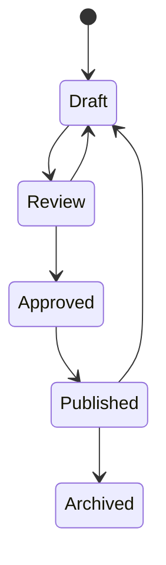

# Knowledge Base Workflow

## Article Lifecycle

## Article Capabilities

- Create and edit article content.
- Associate articles with categories and tags.
- Submit content for review.
- Approve and publish reviewed content.
- Maintain article versions and change summaries.
- Record views and helpful or unhelpful feedback.
- Track usage for support analytics.

## Retrieval Role

Published knowledge-base content can be used as grounding context for ticket assistance. When embeddings and pgvector are available, retrieval uses vector similarity. When the optional AI substrate is not available, the application does not invent article matches or AI answers.

## Governance

The publication workflow separates drafting from approved customer-facing content. Version history provides traceability for changes, while audit records capture important actions.
