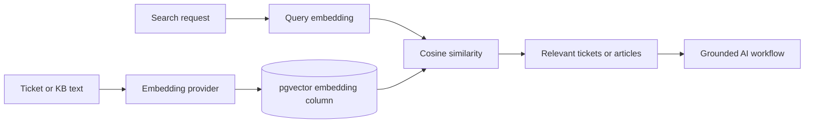

# RAG and Vector Search

## Retrieval Pipeline

## Embeddings

Ticket and knowledge-base text can be converted into embeddings through the configured AI provider. Embeddings are stored with model and version metadata so the source of a vector can be identified.

## Similarity Search

The vector store uses PostgreSQL pgvector queries and cosine-oriented indexes when the extension and embedding columns are available. This supports similar-ticket discovery and knowledge-base retrieval.

## Graceful Degradation

Embedding generation is best effort. If AI credentials, pgvector, or the embedding column are unavailable, the application remains usable without pretending that a semantic result exists. AI endpoints report configuration problems explicitly, and retrieval returns only supported results.

## Data Lifecycle

- New or changed tickets and articles can receive updated embeddings.
- Embedding rows are deduplicated per source record and model context.
- Article and ticket relationships are protected through database foreign keys.

## Verification

Vector behavior is covered by backend tests for insertion, ranking, deduplication, and unavailable-infrastructure behavior.
