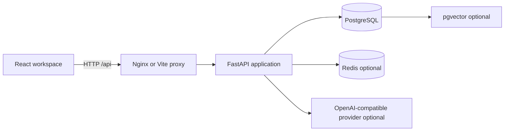

# System Architecture

## High-Level Design

## Request Flow

1. The user interacts with the React and TypeScript frontend.
2. The frontend sends API requests under `/api` with the bearer token.
3. FastAPI authenticates the request and resolves the current user.
4. Permission dependencies enforce role capabilities.
5. Route handlers call service-layer operations.
6. Services read or mutate SQLAlchemy models through PostgreSQL sessions.
7. Audit records, notifications, SLA updates, and optional AI operations are performed as part of the relevant workflow.
8. The API returns a typed JSON response to the frontend.

## Main Components

| Component | Responsibility |
|---|---|
| React frontend | Workspace screens, forms, filters, dashboard, and authenticated client state |
| FastAPI routes | HTTP contracts, dependencies, validation, and response serialization |
| Services | Business rules for tickets, users, KB, analytics, notifications, audit, and SLA |
| SQLAlchemy models | Relational domain model and persistence mapping |
| Alembic | Versioned database schema changes |
| AI service | Provider-backed chat, embeddings, and retrieval orchestration |
| Vector store | Optional pgvector writes and cosine similarity queries |
| Redis | Optional external service for deployment scenarios that enable it |

## Design Principles

- Authorization is enforced on the server.
- Business rules live in services rather than UI components.
- Optional AI functionality fails explicitly or degrades without fabricated output.
- Database changes are versioned through migrations.
- Configuration is externalized through environment variables.
