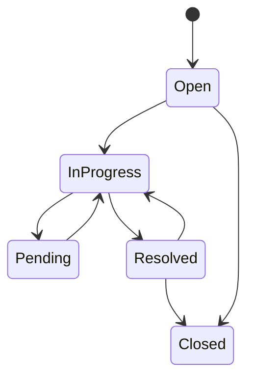

# Ticket Lifecycle

## Lifecycle Workflow

The exact allowed transitions are enforced by the ticket service and should be checked before adding a new status.

## Ticket Operations

- Create a ticket with subject, description, priority, category, and customer information.
- Assign or reassign the ticket to an agent.
- Add public customer replies.
- Add internal notes for support staff.
- Track first response and resolution timestamps.
- Update priority and SLA state.
- Mark duplicates when appropriate.
- Close resolved work.

## Side Effects

Ticket operations may create:

- Audit records.
- Notifications for agents or administrators.
- SLA records and due dates.
- AI embeddings when AI and vector infrastructure are available.

## Authorization

Assignment uses the dedicated assignment permission. Ticket actions are checked against the authenticated user's role and permissions at the backend boundary.
